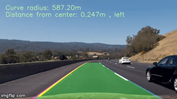

## Advanced Lane Finding

 

### A detailed report can be found in writeup.md file
---

### The Project
---

The goals / steps of this project are the following:

* Compute the camera calibration matrix and distortion coefficients given a set of chessboard images.
* Apply a distortion correction to raw images.
* Use color transforms, gradients, etc., to create a thresholded binary image.
* Apply a perspective transform to rectify binary image ("birds-eye view").
* Detect lane pixels and fit to find the lane boundary.
* Determine the curvature of the lane and vehicle position with respect to center.
* Warp the detected lane boundaries back onto the original image.
* Output visual display of the lane boundaries and numerical estimation of lane curvature and vehicle position.

----
The images for camera calibration are stored in the folder called `camera_cal`.  The images in `test_images` are for testing your pipeline on single frames. 'output_images' folder contains output images from different stages of pipeline

`single_frame_lanedetection.ipynb` contains the tested pipeline for images in the `output_images` folder and `video_lanedetection.ipynb` contains the pipeline used to run on video

### Ouput videos
project_video_output.mp4

project_video_output_diag.mp4

challenge_video_output.mp4

challenge_video_output_diag.mp4
