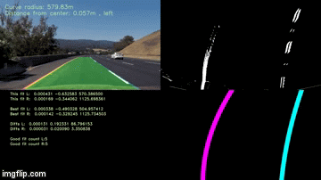

[//]: # (Image References)

[image1]: ./output_images/annotate.png "Final overlayed image"
[image2]: ./sample_imgs/calibration_img.PNG "Chessboard image with corners"
[image3]: ./sample_imgs/undistort_chessboard.PNG "Undistorted chessboard image"
[image4]: ./sample_imgs/test3.PNG "Source frame"
[image5]: ./sample_imgs/undistorted_src_img.PNG "Undistorted image"
[image6]: ./output_images/src_warp_points.png "Source warp points"
[image7]: ./sample_imgs/warped_img.PNG "Perspective transform"

[image8]: ./sample_imgs/sobelx.PNG "Sobelx"
[image9]: ./sample_imgs/sobelx_bin.PNG "Sobelx binary thresholded"
[image10]: ./sample_imgs/hls.PNG "HLS channels"
[image11]: ./sample_imgs/ls_bin.PNG "L+S channel binary thresholded"
[image12]: ./sample_imgs/ls_sobelx.PNG "Final binary output"

[image13]: ./output_images/histogram.png "Histogram"
[image14]: ./sample_imgs/windows_lane.PNG "Window search"
[image15]: ./sample_imgs/visual_polyfit.PNG "Polyfit lane lines"

[video1]: ./project_video.mp4 "Video"

## Advanced Lane Finding

 

## Udacity Self Driving Car Engineer Nanodegree - Project 4

The goal of this project is to develop a pipeline to process a video stream from a forward-facing camera mounted on the front of a car, and output an annotated video which identifies:

1.The positions of the lane lines

2.The location of the vehicle relative to the center of the lane

3.The radius of curvature of the road

4.The pipeline created for this project processes images in the following steps:

### Steps
Step 1: Compute the camera calibration matrix and distortion coefficients given a set of chessboard images.

Step 2: Apply a distortion correction to raw images.

Step 3: Use color transforms, gradients, etc., to create a thresholded binary image.

Step 4: Apply a perspective transform to rectify binary image ("birds-eye view").

Step 5: Detect lane pixels and fit to find the lane boundary.

Step 6: Determine the curvature of the lane and vehicle position with respect to center.

Step 7: Warp the detected lane boundaries back onto the original image.

Step 8: Output visual display of the lane boundaries and numerical estimation of lane curvature and vehicle position.

### Pipeline description
Step 1: Camera Calibration

I start by preparing "object points", which will be the (x, y, z) coordinates of the chessboard corners in the world. A number of images of a chessboard, taken from different angles with the same camera, comprise the input (in ./camera_cal/). Here I am assuming the chessboard is fixed on the (x, y) plane at z=0, such that the object points are the same for each calibration image.  Thus, `objp` is just a replicated array of coordinates, and `objpoints` will be appended with a copy of it every time I successfully detect all chessboard corners in a test image.  `imgpoints` will be appended with the (x, y) pixel position of each of the corners in the image plane with each successful chessboard detection.  

The below image depicts the corners drawn onto a sample chessboard image using the OpenCV function drawChessboardCorners:

![alt text][image2]

I then used the output `objpoints` and `imgpoints` to compute the camera calibration and distortion coefficients using the `cv2.calibrateCamera()` function.  I applied this distortion correction to the test image using the `cv2.undistort()` function and obtained this result: 

![alt text][image3]

Step 2: Distortion Correction

The camera calibration matrix and distortion coefficients obtained from the above step were used with the OpenCV function undistort() to remove distortion from highway driving images.

![alt text][image4]
![alt text][image5]

Step 3: Perspective Transform

In this step, the undistorted image is transformed to a "birds eye view" of the road which focuses only on the lane lines and displays them in such a way that they appear to be relatively parallel to eachother (as opposed to the converging lines you would normally see).
To achieve the perspective transformation I first applied the OpenCV functions getPerspectiveTransform and warpPerspective which take a matrix of four source points on the undistorted image and remaps them to four destination points on the warped image. The source and destination points were selected manually by visualizing the locations of the lane lines on a series of test images.

The source warp points are shown below:

| Source        | 
|:-------------:| 
| 192, 720      | 
| 589, 457      |
| 698, 457     | 
| 1145, 720      |

![alt text][image6]

I verified that my perspective transform was working as expected by drawing the `src` and `dst` points onto a test image and its warped counterpart to verify that the lines appear parallel in the warped image.

![alt text][image7]

Step 4: Binary thresholding

The binarize() function takes in the undistorted warped image (RGB) and applies and HLS color space and sobel thresholding to create a binary thresholded image which highlight only the lane lines and ignore everything else. The L and S channels in the HLS color space was thresholded to min: 120, max: 255 & min: 40, max: 255 repectively. This was combined applying min: 20, max: 255 threshold to sobel filtered image in x direction. The resultant binary image did a good job of highlighting almost all of the white and yellow lane lines. 

Sobel in X_direction

![alt text][image8]

Thresholded Sobel (X) output

![alt text][image9]

HLS channels

![alt text][image10]

LS channels threhsolded

![alt text][image11]

Combining LS binary and Sobel(X) binary

![alt text][image12]

Step 5: Polyfit lane lines

The first of these computes a histogram of the bottom half of the image and finds the bottom-most x position (or "base") of the left and right lane lines. Originally these locations were identified from the local maxima of the left and right halves of the histogram. The image below depicts the histogram generated by sliding_window_polyfit; the resulting base points for the left and right lanes - the two peaks nearest the center - are clearly visible

![alt text][image13]

The function then identifies ten windows from which to identify lane pixels, each one centered on the midpoint of the pixels from the window below. This effectively "follows" the lane lines up to the top of the binary image, and speeds processing by only searching for activated pixels over a small portion of the image. Pixels belonging to each lane line are identified and the Numpy polyfit() method fits a second order polynomial to each set of pixels. The image below demonstrates how this process works:

Window search method

![alt text][image14]

![alt text][image15]

Step 6: Calculate radius of curvature and vehicle position from center

I used the following code to calculate the radius of curvature for each lane line in meters and the final radius of curvature was taken by average the left and right curve radiuses.

    ym_per_pix = 30/720
    xm_per_pix = 3.7/600
    y_eval = np.max(ploty)
    
    left_fit_cr = np.polyfit(lefty*ym_per_pix, leftx*xm_per_pix, 2)
    right_fit_cr = np.polyfit(righty*ym_per_pix, rightx*xm_per_pix, 2)

    left_curverad = ((1 + (2*left_fit_cr[0]*y_eval*ym_per_pix + left_fit_cr[1])* *2)* *1.5) / np.absolute(2*left_fit_cr[0]) 
    right_curverad = ((1 + (2*right_fit_cr[0]*y_eval*ym_per_pix + right_fit_cr[1])* *2)* *1.5) / np.absolute(2*right_fit_cr[0])

    rad = (left_curverad + right_curverad)/2
    return left_curverad, right_curverad, rad

The position of the vehicle with respect to the center of the lane is calculated with the following lines of code:

    xm_per_pix = 3.7/780 
    if left_fit is not None and right_fit is not None:
        car_pos = binary.shape[1]/2
        h = binary.shape[0]
        left_fit_x_int = left_fit[0]*h* *2 + left_fit[1]*h + left_fit[2]
        right_fit_x_int = right_fit[0]*h* *2 + right_fit[1]*h + right_fit[2]
        lane_center_position = (left_fit_x_int + right_fit_x_int) /2
        center_dist = (car_pos - lane_center_position) * xm_per_pix
    return center_dist

The car position is the difference between these intercept points and the image midpoint (assuming that the camera is mounted at the center of the vehicle).
 
Step 7: Unwarp the image back to its original perspective and  Display the lane curvature and vehicle position on the final image

The final step in processing the images was to plot the polynomials on to the warped image, fill the space between the polynomials to highlight the lane that the car is in, use another perspective trasformation to unwarp the image from birds eye back to its original perspective, and print the distance from center and radius of curvature on to the final annotated image.

![alt text][image1]

### Pipeline (video)

The video pipeline first checks whether or not the lane was detected in the previous frame. If it was, then it only checks for lane pixels in close proximity to the polynomial calculated in the previous frame. This way, the pipeline does not need to scan the entire image, and the pixels detected have a high confidence of belonging to the lane line because they are based on the location of the lane in the previous frame.

If at any time, the pipeline fails to detect lane pixels based on the the previous frame, it will go back in to blind search mode and scan the entire binary image for nonzero pixels to represent the lanes.

Here's a [link to my video result](./project_video_output.mp4)

---
### Possible Limitations

The video pipeline developed in this project did a fairly robust job of detecting the lane lines in the test video provided for the project, which shows a road in basically ideal conditions, with fairly distinct lane lines, and on a clear day. It also did a decent job with the challenge video, although it did lose the lane lines momentarily when there was heavy shadow over the road from an overpass.

What I have learned from this project is that it is relatively easy to finetune a software pipeline to work well for consistent road and weather conditions, but what is challenging is finding a single combination which produces the same quality result in any condition.

---
Project video - diagnostic version
[link to my video result](./project_video_output_diag.mp4)

 

